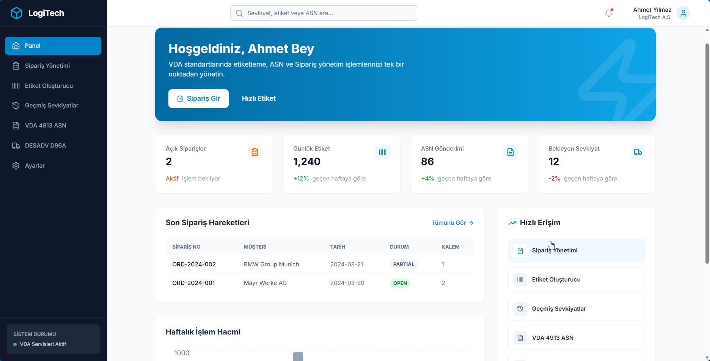
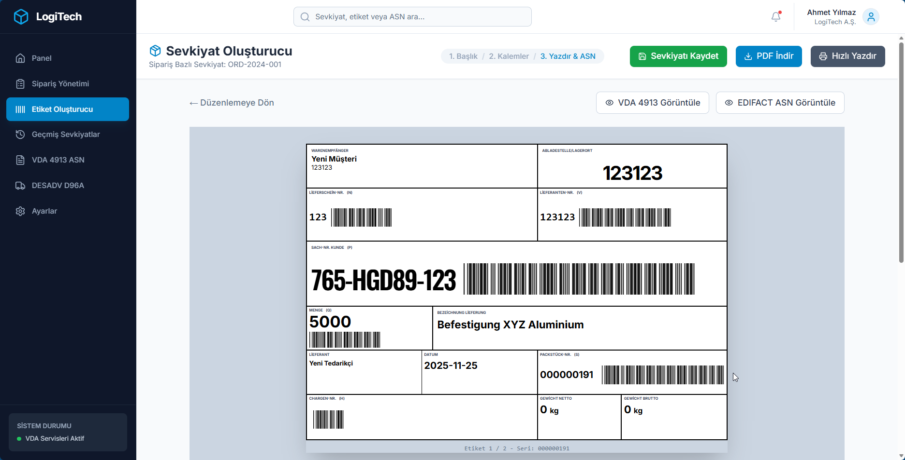
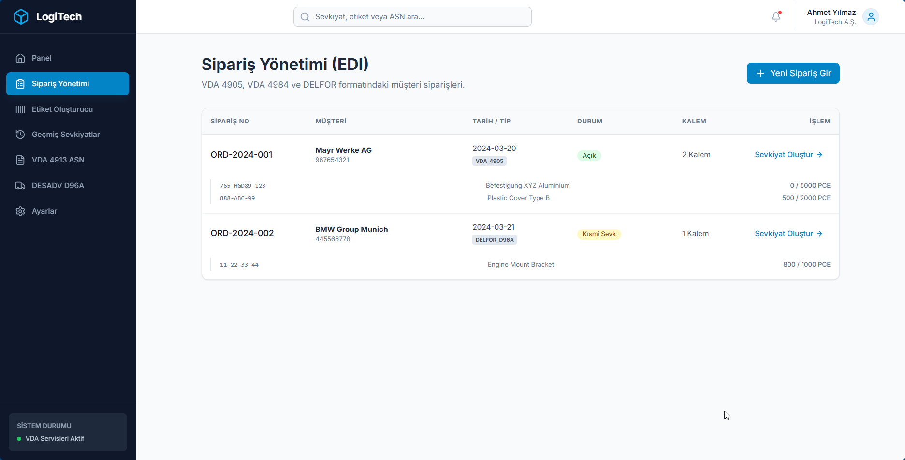
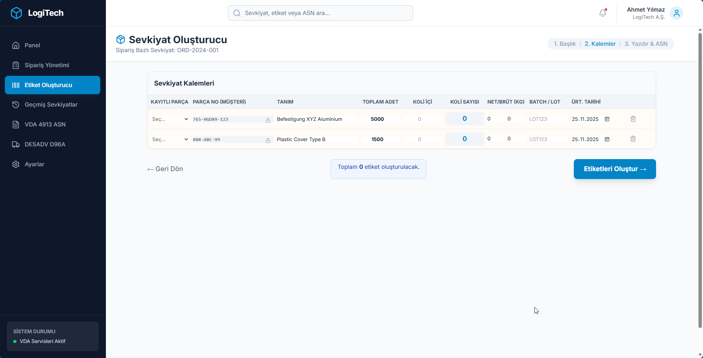
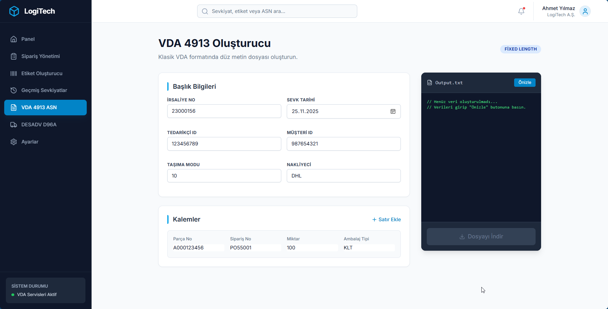

<div align="center">
  
  <h1>LogiTech VDA Suite</h1>
  <p>
    <strong>Otomotiv Sektörü İçin Kapsamlı VDA & EDI Çözümü</strong>
  </p>
  <p>
    powered by <a href="https://www.ubden.com">Ubden®</a>
  </p>
</div>

---

## 🚀 Proje Hakkında

**LogiTech VDA Suite**, otomotiv tedarik zincirinin katı gereksinimlerini karşılamak üzere tasarlanmış, VDA (Verband der Automobilindustrie) standartlarına tam uyumlu, web tabanlı bir lojistik yönetim platformudur.

Bu çözüm, tedarikçilerin OEM ve Tier-1 müşterileriyle (Volkswagen, BMW, Mercedes-Benz vb.) olan veri ve mal akışını dijitalleştirir, hatasız etiketleme ve sevkiyat bildirimi (ASN) süreçlerini garanti eder.

---

## 🏆 Desteklenen VDA Standartları

Uygulama, otomotiv endüstrisinde zorunlu kılınan aşağıdaki standartları tam kapsamlı olarak destekler:

### 🏷️ Etiketleme (Labeling) Standartları

*   **VDA 4902 (Version 4):** Standart Taşıma Etiketi (Odette Transport Label).
    *   **KLT (Kleinladungsträger):** Küçük yük taşıyıcıları için kutu etiketi.
    *   **Palet Etiketi:** Master etiket ve karma yük (Mixed Load) desteği.
    *   **Desteklenen Barkodlar:** Code 39 (Yüksek yoğunluklu), Code 128.
    *   **Alanlar:** Warenempfänger, Abladestelle, Lieferschein-Nr (N), Sach-Nr (P), Menge (Q), vb.

*   **VDA 4994 (GTL - Global Transport Label):** Yeni nesil karekodlu (DataMatrix / QR) küresel taşıma etiketi.
*   **VDA 4906:** Otomotiv üreticileri için özel parça etiketleme standartları.

### 📄 Veri Değişimi (EDI) Standartları

*   **VDA 4913 (Lieferschein- und Transportdaten):**
    *   Elektronik irsaliye ve sevkiyat bildirimi.
    *   Eski nesil sistemlerle tam uyumlu metin tabanlı (Fixed-Length) veri yapısı.
    *   Otomatik 711, 712, 713, 714 kayıt tiplerinin oluşturulması.

*   **EDIFACT DESADV (Despatch Advice):**
    *   D96A ve D01B versiyonları ile uyumlu uluslararası sevkiyat bildirimi.
    *   Karmaşık paketleme hiyerarşisi (CPS segmentleri) desteği.

---

## 🌟 Temel Özellikler

### 1. Akıllı Etiket Motoru
*   **Dinamik Render:** Etiketleri tarayıcıda anlık olarak oluşturur (SVG/Canvas).
*   **Toplu İşlem:** Tek seferde yüzlerce etiketi seri numarası (Serial No) takibi ile oluşturur.
*   **Hata Önleme:** Mükerrer seri numarası ve eksik veri kontrolü.
*   **PDF Export:** Yüksek çözünürlüklü (300 DPI), A4 veya termal yazıcı uyumlu çıktı.

### 2. Sipariş & Sevkiyat Yönetimi
*   **Sipariş Entegrasyonu:** Müşteri siparişlerini (VDA 4905) sisteme aktarma.
*   **Sevkiyat Planlama:** Siparişten sevkiyata (Order-to-Shipment) otomatik dönüşüm.
*   **Paketleme Yönetimi:** Koli içi adet, net/brüt ağırlık hesaplamaları.

### 3. Dijital İkiz & İzlenebilirlik
*   Tüm etiket ve sevkiyatların dijital kayıtları saklanır.
*   Geçmişe dönük etiket sorgulama ve yeniden yazdırma.

---

## 📸 Ekran Görüntüleri

### 📊 Dashboard
VDA operasyonlarınızın kuş bakışı görünümü. Bekleyen siparişler ve sevkiyat durumları.


### 🏷️ VDA 4902 Etiket Oluşturucu
VDA standartlarına uygun, barkod doğrulama özellikli etiket tasarım ekranı.


### 📦 Sipariş Yönetimi
Müşteri siparişlerinin takibi ve bakiye yönetimi.


### 🚛 Sevkiyat Planlama
Etiketlenen ürünlerin sevkiyat planına dönüştürülmesi.


### 📄 ASN (VDA 4913 / DESADV)
Oluşturulan sevkiyat için tek tıkla EDI dosyası üretimi.


---

## 💻 Demo Girişi

Sistemi canlı test etmek için aşağıdaki bilgileri kullanabilirsiniz:

| Rol | Kullanıcı Adı | Şifre |
|---|---|---|
| **Admin** | **demo@demo.com** | **demo** |

---

## 🛠️ Kurulum ve Çalıştırma

**Gereksinimler:** Node.js 18+

1.  **Projeyi Klonlayın:**
    ```bash
    git clone https://github.com/username/logitech-vda-suite.git
    ```

2.  **Kurulum:**
    ```bash
    npm install
    ```

3.  **Başlatma:**
    ```bash
    npm run dev
    ```

---

## 🤝 İletişim ve Kurumsal Destek

Bu proje **Ubden®** tarafından, otomotiv lojistiği uzmanlığı ile geliştirilmiştir.
Özel entegrasyonlar (SAP, Oracle vb.) ve kurumsal lisanslama için bizimle iletişime geçin.

🌐 **Web:** [www.ubden.com](https://www.ubden.com)

<div align="center">
  <sub>© 2025 Ubden® Tüm Hakları Saklıdır.</sub>
</div>
